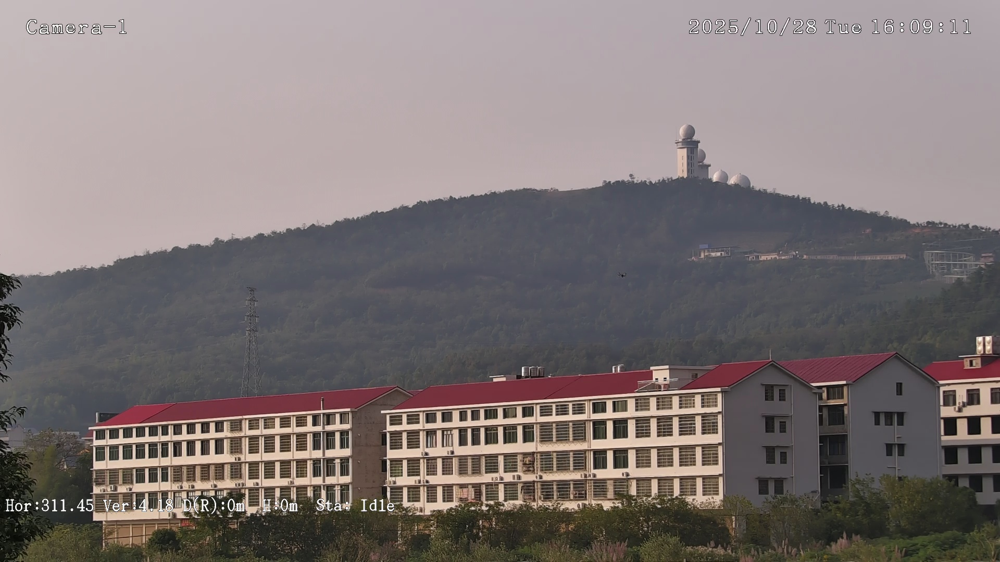
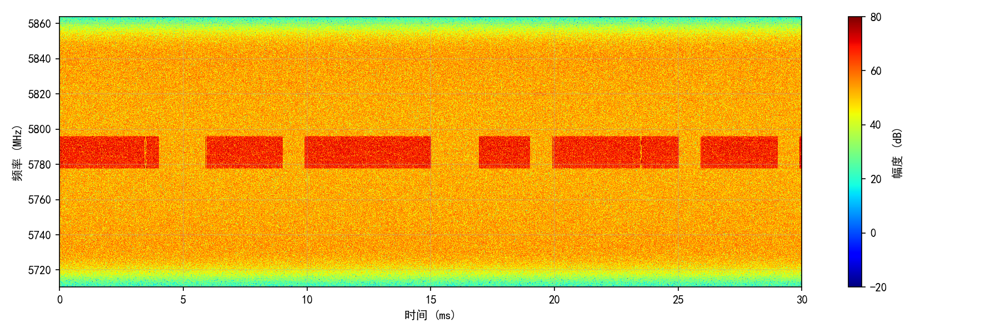
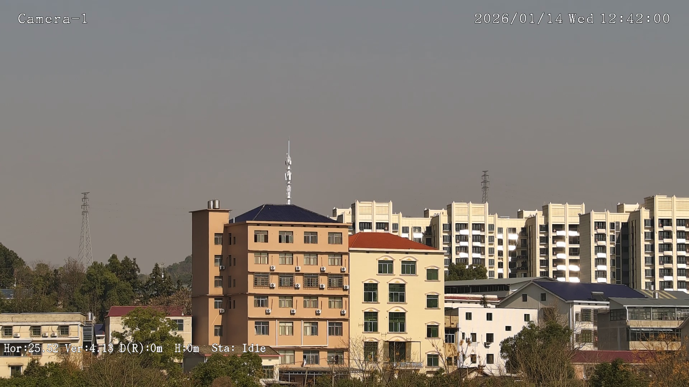
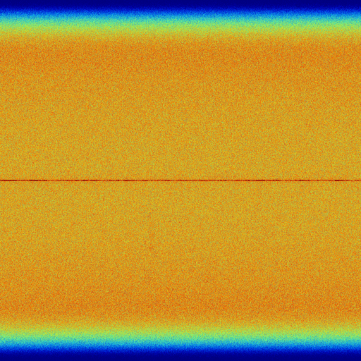
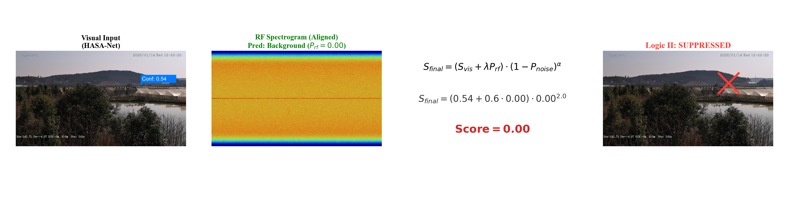
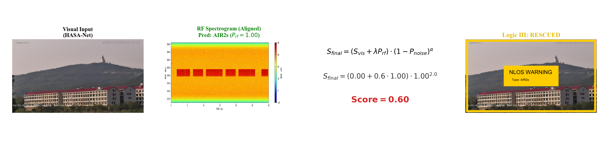
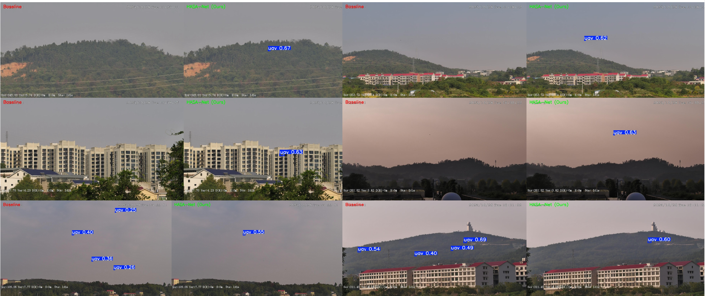

# PiRF Multimodal Collaboration Framework

This repository is a compact, runnable example of the PiRF visual-RF collaborative pipeline.

## Overview

PiRF combines:

- Visual detection branch (HASA-DWS / YOLO)
- RF recognition branch (ResTR)
- Three-state fusion decision logic (State I / II / III)

The project includes scripts for pair indexing, training, and end-to-end inference.

## Project Structure

```text
MCRA/
├─ configs/
├─ data-sample/
├─ scripts/
│  ├─ build_pairs_index.py
│  ├─ train_visual.py
│  ├─ train_rf.py
│  ├─ infer_mcra.py
│  └─ evaluate_visual.py
├─ src/mcra/
│  ├─ data/alignment.py
│  ├─ models/restr.py
│  ├─ fusion/state_machine.py
│  ├─ config.py
│  └─ pipeline.py
├─ artifacts/
└─ requirements.txt
```

## Setup

```bash
pip install -r requirements.txt
```

## Sample Images (from `data-sample`)

Visual/RF input examples:







Fusion result examples:






## Quick Start

1. Build visual-RF pair index:

```bash
python scripts/build_pairs_index.py
```

2. Train visual branch:

```bash
python scripts/train_visual.py
```

3. Train RF branch:

```bash
python scripts/train_rf.py
```

4. Run PiRF inference:

```bash
python scripts/infer_mcra.py
```

5. (Optional) Evaluate visual-only speed:

```bash
python scripts/evaluate_visual.py
```

## Outputs

- Pair index: `artifacts/pairs_index.csv`
- RF checkpoint: `artifacts/checkpoints/restr_best.pth`
- Fusion inference: `artifacts/infer/mcra_infer.csv`
